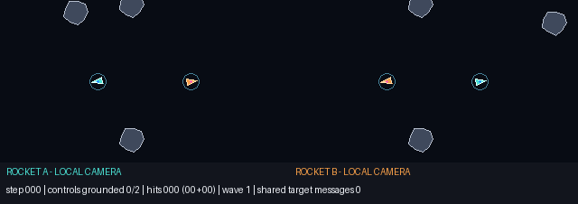
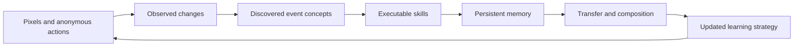
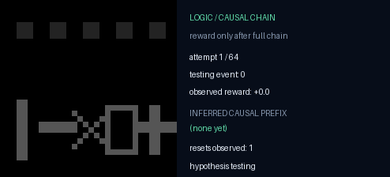
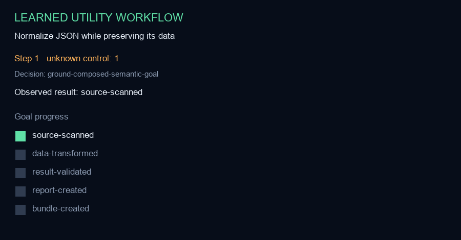
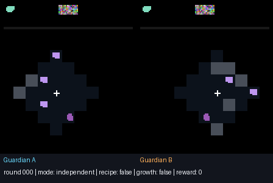
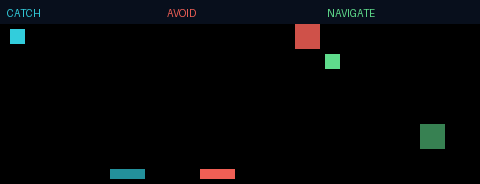

# GUM — Growing Understanding Machine

> A compact, inspectable learner that turns experience into concepts, concepts into skills, and repeated learning into a better learning strategy.



GUM is an experimental continual-learning system. It is deliberately unlike a large language model: it does not begin with a giant store of internet text. It enters a bounded world, observes pixels and consequences, tries actions, records what changes, forms compact internal concepts, and keeps useful procedures.

The project asks:

> Can a machine become better at figuring things out because it has figured things out before?

The current evidence says **yes inside several tested environment families**. It does not yet establish a generally understanding mind. The repository includes passed experiments, mixed results, source, protocols, controls, replays, and limitations so the difference remains visible.

## Built through human–AI collaboration

GUM was conceived, directed, tested, and curated by **Tolga Uz** through extensive iterative collaboration with **OpenAI's ChatGPT and Codex**. The AI systems helped explore architectures, implement code, design tests, analyze failures, assemble evidence, and write documentation.

That collaboration is development provenance—not a hidden source of answers during evaluation. Unless a protocol explicitly says otherwise, ChatGPT/Codex is not inside GUM's experimental learning loop and does not supply its withheld solutions. [Read the complete human–AI collaboration disclosure](AI_COLLABORATION.md).

## Play with it in five minutes

On Windows, double-click:

```text
START_GUM_STUDIO.bat
```

On macOS or Linux:

```bash
chmod +x START_GUM_STUDIO.sh
./START_GUM_STUDIO.sh
```

The first launch prepares a private Python environment. GUM Studio then opens locally in your browser. Nothing is sent to a cloud service.

In **Teaching lab**:

1. Press **Load starter lessons**.
2. Press **Open ambiguity test**.
3. Send `approach the red object`.
4. Answer GUM's question with `the square`.
5. Run the fresh 45-trial audit.

You can also type your own teaching phrase, click the object it describes, repeat with varied scenes, press **Learn meanings**, and inspect exactly which words were grounded.

[Read the playground guide](docs/PLAYGROUND_GUIDE.md)

## What happens inside



The algorithms and boundaries are engineered. The tested action meanings, concepts, successful sequences, word-feature mappings, and acquisition-strategy updates are learned from experience. GUM stores those results as inspectable files rather than hiding all state inside one opaque model.

## Evidence at a glance

| Experiment | Result | What was withheld |
|---|---:|---|
| Growth Challenge v2 | 20/20 transfer; 1,230.59× experienced-vs-blank advantage | concept names, controls, target programs, solutions |
| Concept Genesis | selected five concepts; 20/20 transfer; 498.06× advantage | concept count, event definitions, mechanisms, controls, solutions |
| Real Data Rescue | 5/5 unfamiliar JSONL files repaired; 348× advantage | operation names, fields, mappings, correct order, validator |
| Learning-to-Learn | five minds; median 2.30×, mean 4.48× held-out speedup | task family, dynamics, action meanings, goals, solutions, best strategy |
| Grounded clarification | 45/45; 30/30 ambiguous references resolved | word dictionary and test answers |
| Two-rocket Asteroids | 350 hits; both agents active 8/8; zero friendly fire | coordination policy |
| Photo → glyph → word | 96% apple; **53.22% overall** | direct photo-to-word training |

The final row is intentionally shown as a mixed result: the apple sub-result passed, but the precommitted overall claim failed. GUM's learning-to-learn result also preserves the one seed that regressed to 0.90×.

[Trace every claim to its audit](docs/EVIDENCE.md)

The v0.2.1 hardening build was also rerun from a fresh precommitted Concept
Genesis protocol: 20/20 transfer, 4/4 retention, and a 543.09×
experienced-versus-fresh advantage. This is a fresh internal reproduction, not
independent replication; its protocol and raw traces are included in the
evidence package.

## See it work

| Logic and navigation | Real-file work |
|---|---|
|  |  |
| **A success chain with delayed meaning** | **A visible file-repair workflow** |

| Cooperation | Continual learning |
|---|---|
|  |  |
| **Purpose-built two-agent coordination** | **Retain, revisit, and improve** |

[Open the full demonstration gallery](docs/DEMO_GALLERY.md)

## What GUM currently is

- A compact hybrid of unsupervised concept formation, explicit memory, search, skill compilation, and strategy evolution.
- Able to learn without an LLM inside its experimental loop.
- Persistent across shutdown and reload.
- Auditable through ordinary JSON, JSONL, Markdown, hashes, and replays.
- Able to learn simple visual words from demonstration and ask a targeted clarification question.
- Able to coordinate multiple agents in purpose-built environments.

## What it is not

- Artificial general intelligence, consciousness, or life.
- An unrestricted language learner or natural-scene understanding system.
- A machine that can safely execute arbitrary dropped code.
- A medical or biological reasoning system.
- Independently replicated science—yet.

The strongest defensible description is:

> GUM is a compact, auditable continual learner that forms event concepts from unlabeled experience, compiles them into persistent skills, and evolves a reusable task-acquisition strategy within tested environment families.

## GUM School

GUM School now has a reviewed curriculum, a crash-resumable promotion engine,
three admitted foundational adapters, a bounded cross-seed training lane, and
one officially promoted lesson.
The learner now forms pixel-derived temporal object memory and can spawn helper
policies when uncertainty persists, up to a hard maximum of four. Helpers learn
on separate episodes, exchange value estimates, and vote during evaluation.

After the development rehearsal was quarantined, the source was frozen and a
separate evaluator selected 32 withheld, structurally shifted trials. The
trained swarm scored 32/32, versus 0/32 for a matched fresh swarm and 14/32 for
a random control. All seven gates passed and the engine promoted the first
lesson. This is a narrow object-tracking result; later schools and the transfer
matrix have not run.

[Read the GUM School curriculum](docs/GUM_SCHOOL_CURRICULUM.md)
[Read the GUM School engine boundary](docs/GUM_SCHOOL_ENGINE.md)
[Read the foundational world admission](docs/GUM_SCHOOL_WORLDS.md)
[Read the bounded training rehearsal](docs/GUM_SCHOOL_TRAINING_LANE.md)
[Read the first sealed examination](docs/GUM_SCHOOL_SEALED_EXAM.md)

## Research package

- [Start here](docs/START_HERE.md)
- [Capabilities](docs/CAPABILITIES.md)
- [Architecture in plain language](docs/ARCHITECTURE.md)
- [Preliminary paper](docs/PRELIMINARY_PAPER.md)
- [Evidence and exact claims](docs/EVIDENCE.md)
- [Learning-to-learn explained](docs/LEARNING_TO_LEARN.md)
- [Learning integrity: leaks and hardcoding](docs/LEARNING_INTEGRITY.md)
- [Is it intelligent?](docs/INTELLIGENCE_ASSESSMENT.md)
- [How the project evolved](docs/PROJECT_HISTORY.md)
- [GUM School curriculum and promotion rules](docs/GUM_SCHOOL_CURRICULUM.md)
- [GUM School engine and interruption safety](docs/GUM_SCHOOL_ENGINE.md)
- [GUM School training lane and rehearsal](docs/GUM_SCHOOL_TRAINING_LANE.md)
- [GUM School sealed examinations](docs/GUM_SCHOOL_SEALED_EXAM.md)
- [GUM School implementation handoff](docs/GUM_SCHOOL_HANDOFF.md)
- [Research context and citations](docs/RESEARCH_CONTEXT.md)
- [Reproduce the experiments](docs/REPRODUCING.md)
- [Release verification](docs/VERIFICATION.md)
- [Visual audit](docs/VISUAL_AUDIT.md)
- [Claims and limitations](docs/CLAIMS_AND_LIMITATIONS.md)
- [Public release checklist](docs/PUBLIC_RELEASE_CHECKLIST.md)
- [GitHub for a first-time user](docs/GITHUB_FOR_FIRST_TIME.md)

## Manual installation

GUM requires Python 3.10 or newer.

```bash
python -m venv .venv
# Windows: .venv\Scripts\activate
# macOS/Linux: source .venv/bin/activate
python -m pip install -e ".[dev]"
python -m gum --workspace .gum-workspace serve --release . --open-browser
```

Core verification:

```bash
python -m pytest -q
python -m gum.school curriculum/gum-school-v1.json
python scripts/verify_freeze.py --manifest RELEASE_MANIFEST_GUM_SCHOOL_SEALED_PROMOTION.json
```

The separate Phase 0, Phase 1, Phase 2, training-lane, swarm, and v0.2.1 manifests
remain immutable historical records; they are not regenerated when later
source changes.

The older neural experiments need `python -m pip install -e ".[dev,neural]"`.
Some experiment suites are longer and have separate commands in [Reproducing the work](docs/REPRODUCING.md).

## Repository status

This is the audited public-preview tree. The local archival repository retains the original `gum-v0.1.0-frozen` history, including machine-local provenance that should not be published. The GitHub repository will therefore begin with a fresh, sanitized v0.2 root commit; older bundles stay local and explicitly marked private.

Copyright 2026 Tolga Uz. Licensed under the [Apache License 2.0](LICENSE). The code is permissively reusable under that license; third-party dependencies and referenced works retain their own terms.

