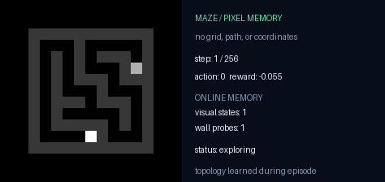
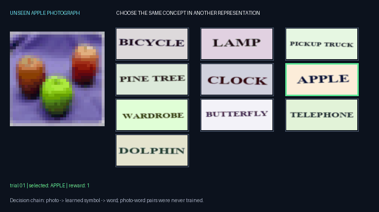

# Demonstration gallery

The recordings below are authentic runs from the project history. They make behavior visible, but the associated JSON audits—not the animation alone—carry the quantitative claim.

## Two-rocket Asteroids

Two agents split threats and coordinate shots. The included audit reports 350 hits, both agents active in 8/8 runs, zero friendly fire, and ablation comparisons.

## Maze escape

A compact illustration of perception, action, and path discovery.

## Hidden logic chain

Success depends on a chain of events rather than one immediately rewarded action.

## Real-file normalization

This is the visually accessible companion to the file-workflow experiments. The stronger current audit is the five-file Data Rescue study.

## Cooperative rescue

This environment is fictional and abstract. It is not a biological or medical simulation.

## Lifelong learning

A project-history montage showing the idea of retaining and revisiting learned abilities.

## Apple concept bridge

This recording belongs to a mixed result. Apple recognition reached 96%, but the precommitted ten-category composed result was only 53.22%; several categories failed badly. Both facts are kept together.

